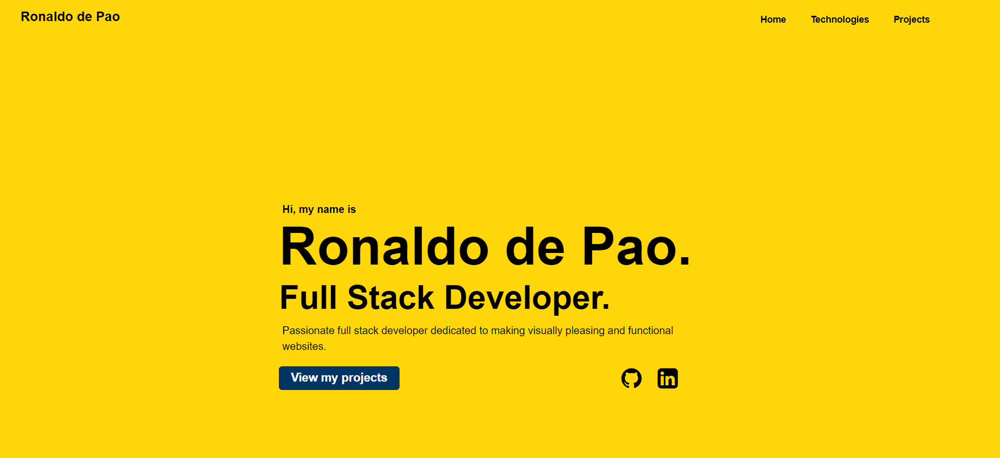

# Personal Portfolio

## Description

This is a web development portfolio I created using vanilla JavaScript and bootstrap. The portfolio lets users know my proficiencies and highlights a few of my favourite applications I have built so far.

### Deployment

This app has been deployed using Vercel and can be found at this [link](https://ronaldodepao.vercel.app/)

### Screenshot

This is a screenshot of the application after clicking the "start game" button 
